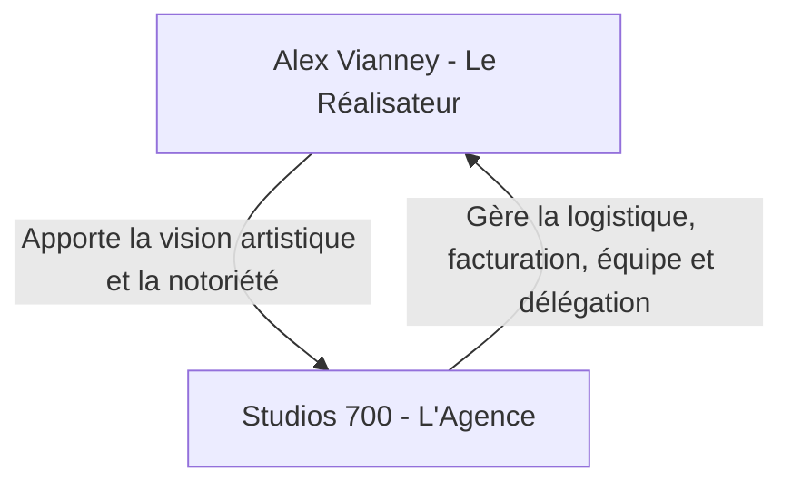

# 🎬 Profil & Carrière Personnelle — Alex Vianney
> *Directeur Artistique, Réalisateur & Artiste VFX. Ce dossier centralise les objectifs de marque personnelle et de croissance d'Alex Vianney.*

---

## 👤 1. IDENTITÉ ARTISTIQUE & FINANCES
* **Nom de scène** : Alex Vianney
* **Rôle** : Réalisateur, Directeur Artistique, Monteur Premium, Artiste VFX
* **Spécialité visuelle** : Rendu cinématique, VFX (After Effects), Animations 3D (Blender), transitions dynamiques.
* **Positionnement** : Le réalisateur de référence à Abidjan pour la culture urbaine, les clips artistiques et la communication de marque.
* **Finances & Tarifs de Réalisation** :
  - *Actuel* : Accepte parfois des budgets à 200 000 XOF pour de petits projets.
  - *Objectif* : **Arrêter les bas prix** et augmenter systématiquement les tarifs pour se positionner comme réalisateur premium (Directeur de Création).
* **Parc Matériel Personnel** :
  - Boîtier : Sony A7 IV (l'A7 III est actuellement en panne).
  - Optiques : Viltrox 16mm f/1.8 (Grand angle) + Sony 50mm f/1.8.
  - *Priorité d'achat* : Remplacer le zoom standard 28-70mm f/2.8 (envoyé en France et déclaré irréparable).

---

## 📈 2. MARQUE PERSONNELLE (PERSONAL BRANDING)
* **TikTok (@alexvianney)** :
  - **Abonnés** : ~98 000 followers (Juin 2026)
  - **Likes** : ~589 000 likes
  - **Type de contenu** : Behind the scenes (BTS), POVs de tournages pour des marques ou artistes, vlogs de création.
* **Instagram (@alexvianneyk)** :
  - **Abonnés** : ~4 450 followers
  - **Bio** : Affilie clairement `@studios700_` et le studio physique `@respectivehub`.
  - **Objectif** : Être la vitrine "Prestige" et la caution artistique de *Studios 700*.

### 🚀 Axe de Croissance TikTok / Réseaux :
1. **Les POVs "Première Personne" (Faceless)** : Montrer l'envers du décor des tournages (caméra à la main, instructions sur le set) sans obligation de montrer son visage au début.
2. **Le format "Podcast / Débat entre amis"** : 
   - Enregistrer des discussions de groupe sur la culture musicale, les albums, la géopolitique.
   - Publier des extraits avec des sous-titres dynamiques et des visuels animés (fonds 3D, extraits de clips).
3. **Le Storytelling Entrepreneurial** : Raconter sa transition de freelance à chef d'entreprise avec le déménagement près du centre-ville et le lancement de la SARL.

---

## 🎓 3. PROGRAMME D'APPRENTISSAGE SUR 8 SEMAINES
Pour débloquer tes compétences en VFX/3D et justifier les tarifs de ton catalogue d'offres créatives futures, voici ta feuille de route d'apprentissage :

* **Semaine 1 — Fondamentaux & Psychologie de l'Animation (After Effects)** :
  - *Sujet* : Fluidité du mouvement (lissage de vitesse, courbes d'animation).
  - *Délivrable* : Création d'une introduction animée logo fluide (Habillage vidéo, vendable ~100 000 XOF).
* **Semaines 2-3 — Animation UI & Style Tech/Apple (After Effects)** :
  - *Sujet* : Animation d'interfaces logicielles épurées (très demandée par les SaaS et startups tech).
  - *Délivrable* : Animation d'interface fictive de 20 secondes (vendable ~250 000 XOF).
* **Semaines 3-4 — Spot Explicatif Complet (SaaS Explainer Ad)** :
  - *Sujet* : Narration visuelle intégrale liée à un argumentaire de vente.
  - *Délivrable* : Vidéo explicative animée de 45 secondes (Service premium vendable ~450 000 XOF).
* **Semaines 4-6 — Immersion Blender 3D & Rendu Photoréaliste** :
  - *Sujet* : Modélisation, matériaux (verre, métaux, condensation), éclairage studio 3 points.
  - *Délivrable* : Animation produit de 10s d'une canette ou d'un parfum réaliste (Option 3D vendable +100K à +250K XOF).
* **Semaines 6-8 — Compositing & Publicités FOOH (Fake Out-Of-Home)** :
  - *Sujet* : 3D Camera Tracking, intégration d'ombres et reflets réels (Shadow Catchers/HDRIs) et étalonnage CGI.
  - *Délivrable* : Intégration d'un sac géant en 3D sur le pont HKB d'Abidjan (Spot FOOH vendable ~500 000 XOF).
* **Semaine 8+ (En continu) — Loops LED de Scène & Concerts (After Effects / Blender)** :
  - *Sujet* : Boucles d'animations infinies (VJ Loops) à haut contraste et résolution d'écrans géants (Resolume specs).
  - *Délivrable* : 3 loops d'écrans abstraits prêtes à diffuser (Option Écrans Concerts vendable ~100 000 XOF / loop).

---

## 🤝 4. SYNERGIE AVEC STUDIOS 700

* **Le Deal** : Les clients achètent la vision artistique d'**Alex Vianney**. Mais c'est **Studios 700** qui produit, qui encaisse l'argent, qui emploie les monteurs freelances, et qui exécute.
* Cela permet à Alex de se concentrer sur son rôle de réalisateur et d'avoir du temps libre pour sa formation technique (Blender/After Effects) et sa vie personnelle.

---

## 🎨 5. LA SIGNATURE VISUELLE : L'AFROFUTURISME
* **Le concept** : Mélanger le tournage de sujets réels (dans le studio physique *Respective Hub* à la Palmeraie) avec des environnements 3D imaginaires, géométriques ou futuristes créés sur Blender et fignolés sur After Effects.
* **Pourquoi c'est ton monopole ?** C'est une barrière technique que 99% d'Abidjan ne peut pas franchir. C'est universel (la 3D parle à Paris comme à New York) et c'est ce qui te sort du lot par rapport aux cadreurs classiques.
* **La règle de survie** : Passer d'un « exécutant débordé » à un « directeur de création rare ». Ne plus faire les montages sans signature de fin ou sans valeur ajoutée technique.

---

## 🤝 6. LE FIEF DES ARTISTES IVOIRO-DIASPORA (TON LEVIER MAJEUR)
* **L'origine** : Alex a commencé par créer des pochettes (covers) pour ses amis d'enfance qui s'amusaient à chanter. Aujourd'hui, ces mêmes amis sont devenus les artistes incontournables et les têtes montantes de la scène ivoirienne (Himra, Didi B, et toute la nouvelle génération).
* **Le positionnement** : Tu n'es pas un prestataire externe qui mendie des tournages. Tu es leur **compagnon de route historique et leur égal artistique**. Ce statut de "famille" te donne un accès exclusif et informel à tous ces artistes.
* **Les 4 Règles de Co-création pour éviter le piège des tarifs d'amis et maximiser le levier** :
  1. **Le "Pack Coprod" (Pas de rabais passif)** : Si un ami artiste influent a un budget trop serré (ex: 200K XOF), n'accepte pas de faire un clip classique à perte. Fais une coproduction créative : en échange du rabais, tu imposes ton scénario à 100% (idéal pour tester des concepts 3D/VFX), tu places ta signature "Alex Vianney / Studios 700" en grand au début et à la fin, tu as le droit exclusif de poster les coulisses (BTS) sur ton TikTok (98K), et tu obtiens des mentions actives (tags collaboratifs) sur leurs posts Instagram.
  2. **Les Visualiseurs 3D / Spotify Canvas** : Au lieu de mobiliser des jours de tournage physique fatigants pour peu de cash, vends-leur des visuels animés 3D en boucle ou des Spotify Canvas (faits sur Blender/After Effects). C'est ultra-rapide à produire, ça valorise ton apprentissage 3D, et c'est très recherché pour les lancements d'albums.
  3. **Le BTS en co-auteur (Double audience)** : Lors de chaque collaboration, filme les coulisses avec ta Pocket 3. Publie des POVs ou des mini-vlogs en format "collaborateur" sur Instagram/TikTok. L'artiste valide ton travail auprès de sa communauté, et toi tu propulses ta marque personnelle auprès de ses fans.
  4. **Grandir en meute** : Quand ils montent à l'international (ex: tournée US de Himra), tu dois être le réalisateur évident qu'ils emmènent dans leurs valises. Utilise le carnet ATA pour être prêt à bouger à tout moment.

