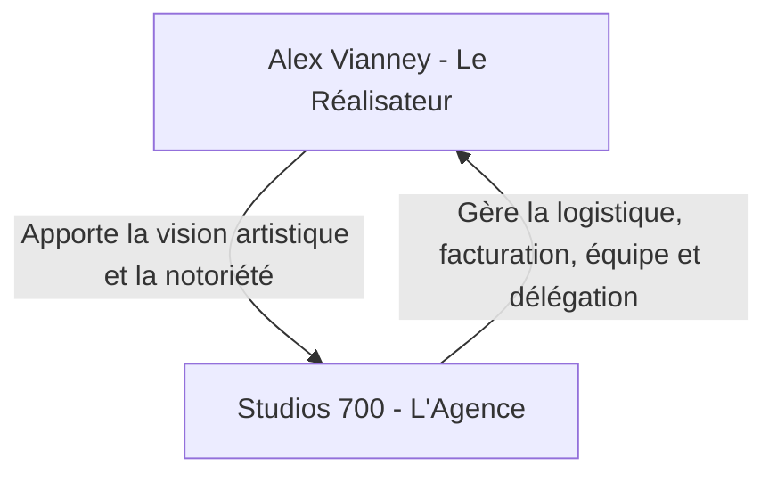

# 🎬 Profil & Carrière Personnelle — Alex Vianney
> *Directeur Artistique, Réalisateur & Artiste VFX. Ce dossier centralise les objectifs de marque personnelle et de croissance d'Alex Vianney.*

---

## 👤 1. IDENTITÉ ARTISTIQUE & FINANCES
* **Nom de scène** : Alex Vianney
* **Rôle** : Réalisateur, Directeur Artistique, Monteur Premium, Artiste VFX
* **Spécialité visuelle** : Rendu cinématique, VFX (After Effects), Animations 3D (Blender), transitions dynamiques.
* **Positionnement** : Le réalisateur de référence à Abidjan pour la culture urbaine, les clips artistiques et la communication de marque.
* **Finances & Tarifs de Réalisation** :
  - *Actuel* : Accepte parfois des budgets à 200 000 XOF pour de petits projets.
  - *Objectif* : **Arrêter les bas prix** et augmenter systématiquement les tarifs pour se positionner comme réalisateur premium (Directeur de Création).
* **Parc Matériel Personnel** :
  - Boîtier : Sony A7 IV (l'A7 III est actuellement en panne).
  - Optiques : Viltrox 16mm f/1.8 (Grand angle) + Sony 50mm f/1.8.
  - *Priorité d'achat* : Remplacer le zoom standard 28-70mm f/2.8 (envoyé en France et déclaré irréparable).

---

## 📈 2. MARQUE PERSONNELLE (PERSONAL BRANDING)
* **TikTok (@alexvianney)** :
  - **Abonnés** : ~98 000 followers (Juin 2026)
  - **Likes** : ~589 000 likes
  - **Type de contenu** : Behind the scenes (BTS), POVs de tournages pour des marques ou artistes, vlogs de création.
* **Instagram (@alexvianneyk)** :
  - **Abonnés** : ~4 450 followers
  - **Bio** : Affilie clairement `@studios700_` et le studio physique `@respectivehub`.
  - **Objectif** : Être la vitrine "Prestige" et la caution artistique de *Studios 700*.

### 🚀 Axe de Croissance TikTok / Réseaux :
1. **Les POVs "Première Personne" (Faceless)** : Montrer l'envers du décor des tournages (caméra à la main, instructions sur le set) sans obligation de montrer son visage au début.
2. **Le format "Podcast / Débat entre amis"** : 
   - Enregistrer des discussions de groupe sur la culture musicale, les albums, la géopolitique.
   - Publier des extraits avec des sous-titres dynamiques et des visuels animés (fonds 3D, extraits de clips).
3. **Le Storytelling Entrepreneurial** : Raconter sa transition de freelance à chef d'entreprise avec le déménagement près du centre-ville et le lancement de la SARL.

---

## 🎓 3. OBJECTIFS D'APPRENTISSAGE & COMPÉTENCES
* **After Effects (Motion Design / VFX)** :
  - Améliorer la maîtrise via des playlists de formation dédiées.
  - Objectif : Créer des génériques animés, des overlays complexes et des effets spéciaux de haut niveau pour les clips.
* **Blender (3D / Virtual Production)** :
  - Apprentissage actif.
  - **Axe principal** : *Camera Tracking* (suivi de mouvement) et création de décors virtuels (Virtual Sets).
  - **Objectif** : Utiliser le studio physique **"Le Hub"** (Palmeraie) pour tourner des sujets réels et les incruster dans des univers 3D créés sur Blender.

---

## 🤝 4. SYNERGIE AVEC STUDIOS 700

* **Le Deal** : Les clients achètent la vision artistique d'**Alex Vianney**. Mais c'est **Studios 700** qui produit, qui encaisse l'argent, qui emploie les monteurs freelances, et qui exécute.
* Cela permet à Alex de se concentrer sur son rôle de réalisateur et d'avoir du temps libre pour sa formation technique (Blender/After Effects) et sa vie personnelle.

---

## 🎨 5. LA SIGNATURE VISUELLE : L'AFROFUTURISME
* **Le concept** : Mélanger le tournage de sujets réels (dans le studio physique *Respective Hub* à la Palmeraie) avec des environnements 3D imaginaires, géométriques ou futuristes créés sur Blender et fignolés sur After Effects.
* **Pourquoi c'est ton monopole ?** C'est une barrière technique que 99% d'Abidjan ne peut pas franchir. C'est universel (la 3D parle à Paris comme à New York) et c'est ce qui te sort du lot par rapport aux cadreurs classiques.
* **La règle de survie** : Passer d'un « exécutant débordé » à un « directeur de création rare ». Ne plus faire les montages sans signature de fin ou sans valeur ajoutée technique.
