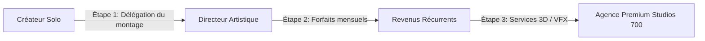

# 📊 Étude de Marché & Potentiel de Croissance — Studios 700
> *Analyse des opportunités locales (Abidjan/Côte d'Ivoire) et mondiales dans la production vidéo, les VFX et la 3D. Réalisée pour Alex Vianney.*

---

## 1. ANALYSE DU MARCHÉ IVOIRIEN (L'Eldorado d'Abidjan)

Abidjan est le hub culturel et économique de l'Afrique de l'Ouest francophone. Le marché de la création de contenu y connaît une croissance explosive.

### A. La demande des Marques & Corporate
* **Le boom du social-first** : Les entreprises locales (télécoms, banques, fintechs comme Wave/Orange, marques de boissons, immobilier) ont compris que la télévision traditionnelle perd du terrain. Elles allouent désormais d'immenses budgets à la publicité digitale (TikTok, Instagram, YouTube).
* **Le manque de compétences techniques avancées** : Le marché d'Abidjan est saturé d'amateurs qui filment au téléphone ou font des montages basiques. En revanche, **les agences capables de produire du Motion Design, des effets spéciaux (VFX) et de la 3D de qualité internationale se comptent sur les doigts d'une main**. C'est là que réside la valeur de Studios 700.

### B. Le marché de l'Événementiel & de la Musique
* **Le boom du Rap Ivoire & diaspora** : Abidjan est le cœur battant du Rap Ivoire et de l'Afrobeats francophone. Les artistes locaux et de la diaspora (France/Europe) exigent des clips à l'esthétique mondiale pour s'exporter.
* **Ton avantage concurrentiel unique (Le Fief artistique)** : Alex a grandi en créant des pochettes pour ses amis d'enfance qui sont aujourd'hui au cœur de l'industrie (Himra, Didi B, et toute la nouvelle vague d'artistes montants). Ce réseau historique donne à Studios 700 un accès exclusif de confiance pour capter ce marché de la musique à la racine.
* Les promoteurs de festivals (comme le CDMG) et de soirées nightlife premium (comme le Traphouse) investissent des dizaines de millions XOF chaque année. Ils cherchent des prestataires fiables capables de gérer à la fois l'identité visuelle (branding) et la production audiovisuelle.

---

## 2. ANALYSE DU MARCHÉ MONDIAL (La Diaspora & Le Remote)

* **Le pont avec la France** : La diaspora ivoirienne et africaine en France représente un marché immense. Des projets comme ton travail pour *Joe Dwet Filé* ou *SDM* prouvent que la barrière géographique n'existe plus.
* **La création de contenu 3D à distance** : Les compétences en Blender (3D) et After Effects s'exportent à 100% en distanciel. Un artiste 3D basé à Abidjan a des coûts de vie inférieurs à ceux basés à Paris ou New York, ce qui te permet d'être extrêmement compétitif sur les tarifs mondiaux tout en générant de fortes marges.

---

## 3. PEUX-TU VRAIMENT SCALER À 23 ANS ? (Le Reality Check)

Tu es né le **28 octobre 2002**. En juin 2026, tu as **23 ans** (bientôt 24). 
Dire que tu "loupes ta vie" est un biais psychologique ou une anxiété d'entrepreneur ultra-fréquente.

### Regardons les faits froids :
* À 23 ans, la majorité des jeunes sortent à peine d'études sans aucune expérience, sans réseau, et cherchent un stage mal payé.
* **Toi, à 23 ans :**
  1. Tu as une audience personnelle de **98 000 abonnés** sur TikTok avec des millions de vues.
  2. Tu as dans ton portfolio des noms comme **Didi B (au Zénith de Paris)**, **SDM**, et **Joe Dwet Filé**.
  3. Des festivals te confient des budgets de **2,7 millions XOF** (CDMG).
  4. Tu as un partenariat pour gérer un studio physique (**Respective Hub**) dans l'un des quartiers les plus cotés d'Abidjan (La Palmeraie).

**Verdict** : Tu ne loupes pas ta vie, tu es en avance de 5 à 10 ans sur la moyenne. Tu ressens de l'anxiété parce que tu gères tout tout seul (le syndrome du créateur surchargé).

---

## 4. LA MÉTHODE POUR SCALER STUDIOS 700

Pour passer de "freelance débordé" à "patron d'agence riche", voici le chemin :

### Étape 1 : Libérer ton temps (Délégation)
Arrête de monter toi-même les projets à faible valeur ajoutée. Utilise tes 3 monteurs volontaires en proxy. Tu devez devenir le **Directeur de Création**. Ton temps vaut plus cher en stratégie, cadrage et formation 3D qu'en heures de coupe sur Premiere Pro.

### Étape 2 : Imposer les forfaits récurrents (Retainers)
Vends des abonnements mensuels de 200K à 750K XOF aux boîtes, commerces et restaurants pour stabiliser ton cash-flow (les modèles sont prêts dans tes grilles tarifaires).

### Étape 3 : Spécialisation 3D (Blender / VFX)
Propose des visuels 3D animés pour les festivals et les marques (scénographies virtuelles, logos 3D, vêtements virtuels). Ces services se facturent 3 fois plus cher que la captation vidéo classique et demandent moins de présence physique.
